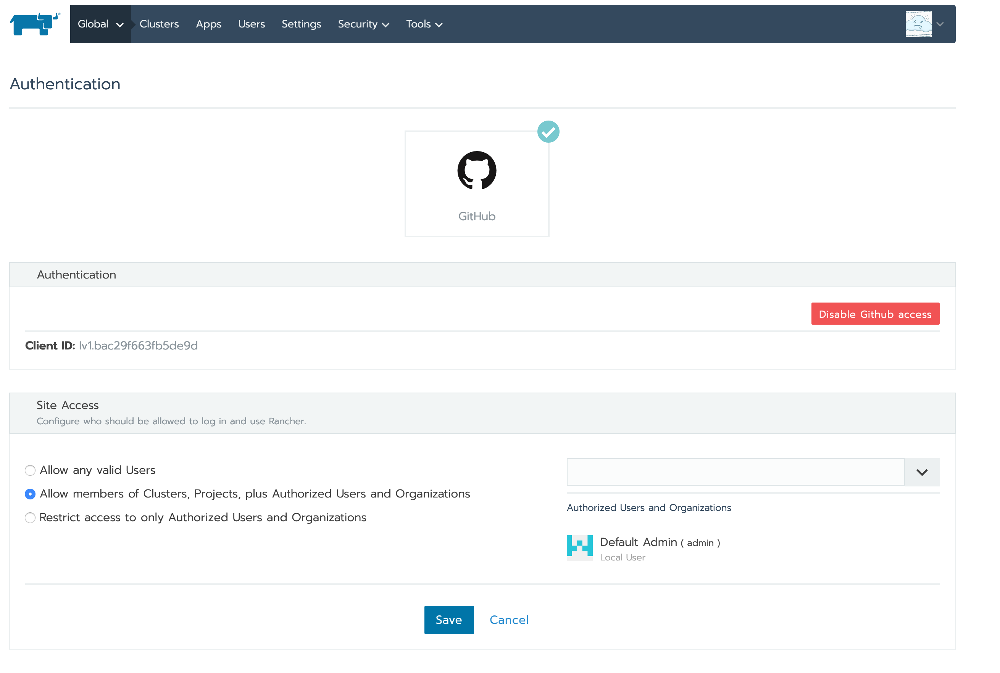

## Setting up an External Authentication provider
The aim of this document is to explain how to integrate Rancher with your existing identity provider.

By default when Rancher boots up it only starts with local authentication provider.

Rancher allows users to add an extra authentication provider in addition to the in built local provider.

The option to enable Authentication is available in the Security Menu.

Rancher supports the following identity providers:

For the purpose of this example we are going to use the Github identity provider.

The Github provider needs registered applcation to be created in your Github account, and Rancher needs the Client ID and Client Secret for the app.

This easy to perform from he Developer Settings option:

Please provide the information specified in the Rancher UI, when creating the Application.

Once the information is input, then please Authorise the application.

Github will generate a Client ID and a Client Secret.

This can now be entered in the Rancher UI.

Once this is done please click "Enable", and you should see the authentication enabled.

Please logout from Rancher, and now the login screen will show the ability to use Github and Local User.

